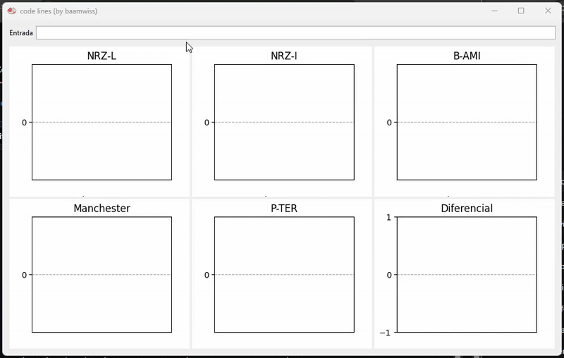

# CodeLines
CodeLines is an educational visualizer for digital signal encoding schemes. Allows you to input a binary sequence and observe how different encoding methods convert that sequence into a waveform.



## Downloads
Executable bundles are available so you can try the program without installing anything:

| Platform | Download      |
|----------|---------------|
| Windows  | [CodeLines.exe](https://github.com/baam-i/code_lines/releases/latest/download/CodeLines.exe) | 
| Linux    | (coming soon) | 
| Macos    | (coming soon) | 

Antivirus software may flag the executable as a potential threat. This happens because the files are not digitally signed, not because they are unsafe.

## For developers
This project is built with Python 3.12+, so just follow the usual routine:

Install the dependencies:

```
pip install requirements.txt
```

Run the app:

```
python main.pyw
```

Want a standalone executable (on windows)? Just run: 

```
build.cmd
```
That’s it, you’re good to go.
